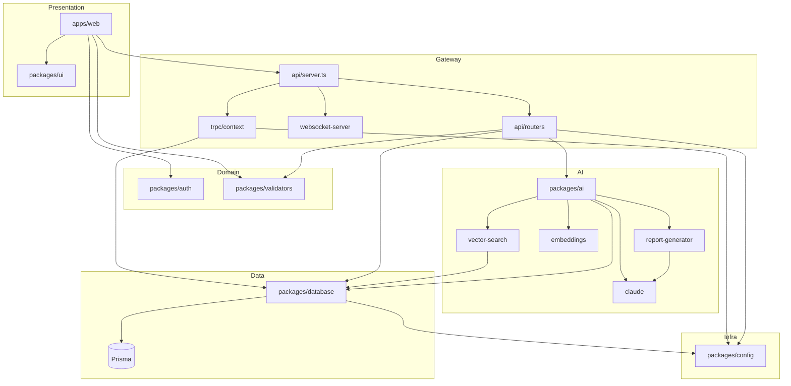

# Canopy Sight — Full Repository Intelligence Scan

**Generated:** Repository-wide scan. No code modified.

---

## 1. Repository Index & Entry Points

### 1.1 Workspace Layout

| Workspace | Path | Purpose |
|-----------|------|---------|
| **Root** | `/` | Monorepo root; Turbo; Vitest; Prettier |
| **apps/web** | `apps/web` | Next.js 14 (App Router) dashboard |
| **apps/api** | `apps/api` | Express + tRPC API server |
| **apps/edge-agent** | `apps/edge-agent` | Raspberry Pi / edge detection agent |
| **packages/ui** | `packages/ui` | Shared React UI (ShadCN-style) |
| **packages/database** | `packages/database` | Prisma client + schema |
| **packages/auth** | `packages/auth` | Clerk re-exports (demo build uses headers) |
| **packages/config** | `packages/config` | Logger, shared TS/ESLint configs |
| **packages/validators** | `packages/validators` | Zod schemas (site, device, alert, etc.) |
| **packages/ai** | `packages/ai` | Claude, report generator, embeddings, LangChain |
| **services/alert-engine** | `services/alert-engine` | Stub (TODO: WebSocket/SMS/Email) |
| **services/video-processor** | `services/video-processor` | Stub (TODO: transcoding/BullMQ) |

### 1.2 Entry Points

| Entry | File | Trigger |
|-------|------|---------|
| **Web app** | `apps/web/src/app/page.tsx` (root), `layout.tsx` | Next.js; root redirects to `/dashboard` or `/sign-in` |
| **API server** | `apps/api/src/server.ts` | `npm run dev` / `start` in apps/api |
| **API package (types)** | `apps/api/src/index.ts` | Re-exports `appRouter`, `RouterOutputs` for web |
| **Edge agent** | `apps/edge-agent/src/index.ts` | Standalone process; Camera → YOLO → API sync |
| **Alert engine** | `services/alert-engine/src/index.ts` | Stub (console.log only) |
| **Video processor** | `services/video-processor/src/index.ts` | Stub (console.log only) |

---

## 2. Full Dependency Graph (Package → Package)

```
                    ┌─────────────────┐
                    │  canopy-sight    │ (root)
                    │  turbo, vitest   │
                    └────────┬────────┘
                             │
     ┌───────────────────────┼───────────────────────┐
     │                       │                       │
     ▼                       ▼                       ▼
┌─────────┐            ┌──────────┐            ┌──────────────┐
│ apps/web│            │ apps/api │            │ edge-agent   │
└────┬────┘            └────┬─────┘            └──────┬───────┘
     │                      │                          │
     │  @canopy-sight/api (types only)                 │
     │  @canopy-sight/auth   │                          │ HTTP to API
     │  @canopy-sight/ui     │  @canopy-sight/ai        │ (sync/api-client)
     │  @canopy-sight/       │  @canopy-sight/auth      │
     │    validators         │  @canopy-sight/database  │
     │                      │  @canopy-sight/validators│
     │                      │  @canopy-sight/config    │
     │                      └──────────┬───────────────┘
     │                                 │
     │  ┌─────────────────────────────┼─────────────────────────────┐
     │  │                              │                               │
     ▼  ▼                              ▼                               ▼
┌─────────┐  ┌────────────┐  ┌────────────────┐  ┌────────────┐  ┌─────────────┐
│  ui     │  │   auth    │  │      ai        │  │  database  │  │ validators  │
└─────────┘  └────────────┘  └───────┬────────┘  └──────┬─────┘  └─────────────┘
                                    │                   │
                                    │  @canopy-sight/   │  @canopy-sight/
                                    │  database         │  config
                                    │  (vector-search,  │  (logger)
                                    │   advanced-       │
                                    │   analytics)      │
                                    └──────────────────┘
```

### 2.1 App-Level Dependencies (npm)

- **apps/web**: `@canopy-sight/api`, `@canopy-sight/auth`, `@canopy-sight/ui`, `@canopy-sight/validators`, `@tanstack/react-query`, `@trpc/client`, `@trpc/react-query`, `next`, `react`, `react-dom`, `socket.io-client`, `zod`, etc.
- **apps/api**: `@canopy-sight/ai`, `@canopy-sight/auth`, `@canopy-sight/database`, `@canopy-sight/validators`, `@trpc/server`, `express`, `cors`, `helmet`, `socket.io`, `zod`, etc.
- **apps/edge-agent**: (no internal workspace deps in package.json; uses env + HTTP to API)
- **packages/database**: `@canopy-sight/config`, `@prisma/client`
- **packages/ai**: `@anthropic-ai/sdk`, `openai`, `@langchain/*`; **no** `@canopy-sight/database` in package.json but **imports it in code** (advanced-analytics, vector-search) — API brings database in.
- **packages/config**: TypeScript, ESLint; no internal workspace deps.
- **packages/validators**: `zod` only.
- **packages/auth**: `@clerk/nextjs/server` (re-exports).

---

## 3. Execution Flow Map

### 3.1 Web (Next.js)

1. **Request** → `middleware.ts` (no-op; Clerk removed) → `layout.tsx` → `Providers` (tRPC + React Query + Toast) → `Navigation`, `DemoBanner`, `SimulationBanner`, `ServerStatus`, `ConnectionStatus` → **page**.
2. **Root `/`**: Server: `cookies()` + `auth()` (Clerk) → redirect to `/dashboard` or `/sign-in`.
3. **Data**: Pages use `trpc.*.useQuery` / `useMutation`; client talks to `/api-proxy/trpc` or `NEXT_PUBLIC_API_URL/trpc`.
4. **WebSocket**: `use-websocket.ts` → `socket.io-client` → `NEXT_PUBLIC_WS_URL` or API URL; auth: `demoMode: true` or token placeholder.

### 3.2 API (Express)

1. **Start**: `server.ts` → `setupSentry()` → `express()` → `createServer(app)` → `WebSocketServer(httpServer)` → `setWsServerRef(wsServer)` → `alertDispatcher.setWebSocketServer(wsServer)` → `eventAggregator.start()` → `setupSecurityMiddleware(app)` → CORS, `express.json()` → `GET /health` → `app.use("/trpc", createExpressMiddleware({ router: appRouter, createContext }))` → OpenAPI routes → error handler → 404 → `httpServer.listen(3001)`.
2. **tRPC**: Every request → `createContext()` (demo headers → Prisma upsert org/user → `{ userId, organizationId, userRole, prisma }`) → `appRouter` → procedure (protected/public) → router handler → Prisma / AI / validators → response.
3. **WebSocket**: `authenticate` (demoMode or token) → `subscribe:alerts`, `subscribe:detections`, `subscribe:devices` → events pushed to clients.

### 3.3 Edge Agent

1. **Start**: `EdgeAgent` → `Camera`, `YOLODetector`, `SORTTracker`, `ZoneAnalyzer`, `RiskScorer`, `APIClient`, `OfflineQueue`, `LoiteringDetector`, `PPEDetector`, optional `MeshConnectManager`.
2. **Loop**: Frame capture → YOLO detect → SORT track → zone/risk analysis → loitering/PPE checks → send events to API via `APIClient` or queue when offline.

---

## 4. Module Boundaries & Architectural Layers

| Layer | Packages / Apps | Responsibility |
|-------|------------------|----------------|
| **Presentation** | apps/web, packages/ui | Pages, components, routing, tRPC client |
| **API / Gateway** | apps/api (server, middleware, trpc) | HTTP, WebSocket, auth context, routing to procedures |
| **Application / Use cases** | apps/api (routers) | Site, device, detection, alert, zone, analytics, incident, model, ingestion, meshconnect, notification, system, video |
| **Domain / Shared** | packages/validators, packages/auth | Schemas, role helpers, Clerk re-exports |
| **AI / ML** | packages/ai | Claude, report generation, embeddings, LangChain, vector search, incident analysis |
| **Data access** | packages/database | Prisma client, schema, health check |
| **Infrastructure** | packages/config, Sentry, Redis (cache) | Logging, env, monitoring, caching |
| **Edge** | apps/edge-agent, services/* | Capture, inference, sync, (stubs for alert-engine, video-processor) |

---

## 5. API Endpoints Map

| Type | Path | Source |
|------|------|--------|
| **REST** | `GET /health` | server.ts |
| **REST** | `GET /api/openapi.json`, `GET /api/docs`, `GET /docs` | openapi middleware |
| **tRPC** | `POST /trpc/*` | All procedures under appRouter |
| **WebSocket** | Socket.IO on same HTTP server | websocket-server.ts |

### 5.1 tRPC Routers & Procedures (High Level)

- **site**: list, byId, create, update, delete
- **device**: list, byId, create, update, delete
- **detection**: list, stats, create (with optional alert)
- **alert**: list, byId, create, update, acknowledge, resolve
- **zone**: list, byId, create, update, delete
- **analytics**: heatmap, trends, behavioralPatterns, occupancyByZone, timeOfDayPressure, **generateReport**
- **video**: listClips, getSignedUrl, createClip
- **notification**: list, create, update, delete
- **system**: ping, health
- **incident**: list, byId, create, update, resolve, reconstruction
- **model**: history (playback)
- **ingestion**: ingest (device ingestion)
- **meshconnect**: getConfig, updateConfig, getTopology

---

## 6. Database Interactions

- **ORM**: Prisma (PostgreSQL); schema in `packages/database/prisma/schema.prisma`.
- **Models**: Organization, User, Site, Device, CameraConfig, MeshConnectConfig, DeploymentLog, DetectionEvent, RiskScore, Alert, DetectionZone, VideoClip, Heatmap, IncidentReport, SystemHealth, AuditLog, NotificationPreference.
- **Access**: All write/read goes through `ctx.prisma` in tRPC context. `createContext` runs org/user upsert (demo) then injects `prisma`.
- **External**: `packages/ai` (advanced-analytics, vector-search) imports `@canopy-sight/database` (PrismaClient) — used only from API when calling AI packages.

---

## 7. External Service Integrations

| Service | Where | Purpose |
|---------|--------|---------|
| **Clerk** | packages/auth, apps/web (root page auth()) | Auth re-exports; root page redirect; demo bypass via cookie |
| **Anthropic** | packages/ai (claude.ts, langchain/chains) | Reports, incident analysis, chains |
| **OpenAI** | packages/ai (embeddings, langchain) | Embeddings, optional chains |
| **Sentry** | apps/api (monitoring/sentry.ts) | Error/trace monitoring when SENTRY_DSN set |
| **Redis** | apps/api (services/cache.ts) | Optional cache; REDIS_HOST / REDIS_URL |
| **Twilio** | apps/api (alert-dispatcher; commented) | Optional SMS; not active |
| **PostgreSQL** | packages/database | Primary store; DATABASE_URL |

---

## 8. Build Tooling & Infrastructure

- **Monorepo**: npm workspaces (`apps/*`, `packages/*`, `services/*`).
- **Build**: Turbo; `build` depends on `^build`; outputs: `.next/**`, `dist/**`, `build/**`.
- **Web**: Next.js 14 (standalone output); tsconfig inlined; webpack aliases for workspace packages; Tailwind with base from `packages/ui/tailwind.config.js` (path-resolved).
- **API**: TypeScript; build script runs `tsc -p apps/api` from repo root (for workspace resolution).
- **Tests**: Vitest (root); tests in `apps/api/src/__tests__/*`.
- **Deploy**: Fly.io (API, web); Docker; CI (e.g. .github/workflows).

---

## 9. Module Interaction Diagram (Mermaid)



---

## 10. Identified Architectural Issues

### 10.1 Circular Dependencies

- **None detected** in the workspace graph. Dependency order: config, validators, auth (leaf) → database (config) → ai (database) → api (database, config, validators, ai). Web consumes api (types), auth, ui, validators.

### 10.2 God Modules / Unclear Boundaries

- **apps/api/src/server.ts**: Orchestrates Express, CORS, health, tRPC, OpenAPI, error/404, WS; acceptable for a single server entry.
- **apps/api/src/trpc/context.ts**: Creates context and does demo org/user upsert; could be split into “auth resolution” vs “context assembly” for clarity.
- **apps/edge-agent/src/index.ts**: Orchestrates all edge components; single entry is reasonable but is the largest single file.

### 10.3 Tightly Coupled Services

- **createContext** and **demo org/user upsert**: Every tRPC request hits Prisma for upsert; no in-process cache of demo org/user. Acceptable for demo; for production, consider caching or moving to middleware.
- **Web** always sends demo headers (providers.tsx); API always derives user from headers. Tied to “demo-only” auth design.

### 10.4 Duplicated Logic

- **Demo vs “real” auth**: Root page uses cookie + Clerk auth(); rest of app uses `useCanUseProtectedTrpc()` (always true) and demo headers. Two auth paths.
- **Error messaging**: Some pages use `error.message`, others inline strings; could be centralized.
- **Env defaults**: e.g. `NEXT_PUBLIC_API_URL || "http://localhost:3001"` repeated in providers, api-proxy, use-websocket; could be one shared constant.

### 10.5 Unclear Boundaries

- **packages/ai** importing **@canopy-sight/database**: AI package depends on DB; used only when API calls AI. Could be inverted (API fetches data, passes to AI) to keep AI free of DB.
- **services/alert-engine** and **services/video-processor**: Stubs only; no clear contract or integration point with API yet.

### 10.6 Dead / Stub Code

- **services/alert-engine**: Only `console.log`; TODO for WebSocket/SMS/Email.
- **services/video-processor**: Only `console.log`; TODO for transcoding.
- **packages/auth**: Clerk still exported; middleware is no-op; used only for root `auth()` and type imports.

---

## 11. Files Inventory (Summary)

- **TypeScript/TSX**: ~115 .ts, ~46 .tsx (apps/web, apps/api, apps/edge-agent, packages, services).
- **Config**: package.json (13), tsconfig (multiple), next.config.js, tailwind, postcss, turbo.json, vitest.config.ts, Dockerfile(s), fly.toml.
- **Prisma**: 1 schema; migrations in packages/database/prisma/migrations.

---

## 12. Security & Configuration Touchpoints

- **Secrets / env**: DATABASE_URL, ANTHROPIC_API_KEY, OPENAI_API_KEY, SENTRY_DSN, REDIS_*, FRONTEND_URL, ALLOWED_ORIGINS, NEXT_PUBLIC_*, Clerk keys (optional), Edge: DEVICE_ID, SITE_ID, API_URL, API_KEY, ENABLE_MESHCONNECT, MESHCONNECT_DEVICE_ID.
- **Auth**: Demo via headers (x-demo-mode, x-demo-user-id, x-demo-organization-id, x-demo-user-role); WebSocket accepts demoMode in non-production; Clerk used only for root redirect when not demo.
- **CORS**: Configured in server.ts (localhost, ngrok, Fly, ALLOWED_ORIGINS).

---

**End of STEP 1 — Repository Intelligence Scan.**  
No code was modified. This document is the internal model for the autonomous transformation pass (STEP 2).
